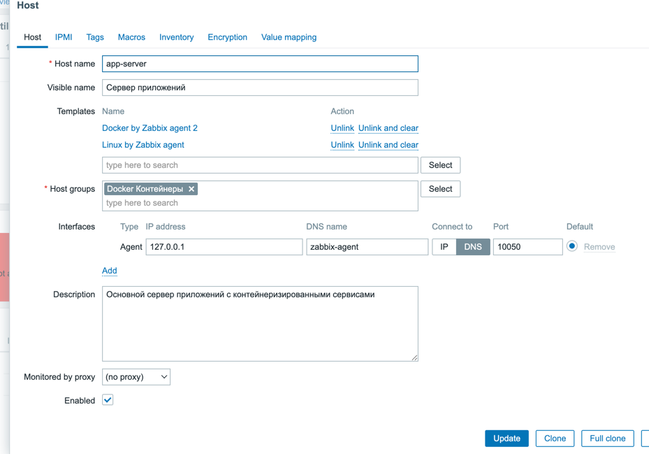
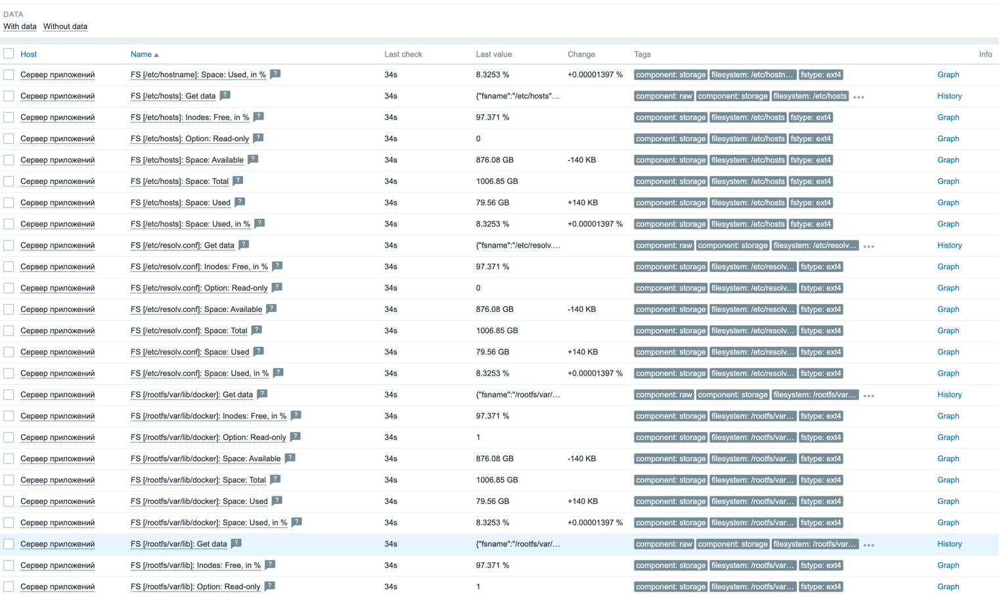

- добавил контейнеры забикса
- обновил RED-метрики и добавил несколько бизнес метрик на ручках регистрациии написания постов
- запускаем контейнеры 
```shell
d1b6b507dcd6   zabbix-web               Up 22 seconds (healthy)            0.0.0.0:8443->8443/tcp, [::]:8443->8443/tcp, 0.0.0.0:8084->8080/tcp, [::]:8084->8080/tcp       zabbix/zabbix-web-nginx-pgsql:alpine-6.4-latest
c5aff3d9aae8   zabbix-agent             Up 22 seconds (healthy)            0.0.0.0:10050->10050/tcp, [::]:10050->10050/tcp                                                zabbix/zabbix-agent2:alpine-6.4-latest
d7f4b9c970b7   nginx                    Up 6 seconds                       0.0.0.0:80->80/tcp, [::]:80->80/tcp, 0.0.0.0:8080->8080/tcp, [::]:8080->8080/tcp               nginx:1.21
b1aa29694cdf   dialog                   Up 12 seconds (healthy)            0.0.0.0:50051->50051/tcp, [::]:50051->50051/tcp                                                docker-dialog
53110ba41fcb   feed-updater             Up 12 seconds                      0.0.0.0:8081->8081/tcp, [::]:8081->8081/tcp                                                    docker-feed-updater
a585fe5cd683   app1                     Up 12 seconds (healthy)            0.0.0.0:8082->8080/tcp, [::]:8082->8080/tcp                                                    docker-app1
2296522ed9ea   zabbix-server            Up 22 seconds                      0.0.0.0:10051->10051/tcp, [::]:10051->10051/tcp                                                zabbix/zabbix-server-pgsql:alpine-6.4-latest
9ac568950ce7   app2                     Up 12 seconds (healthy)            0.0.0.0:8083->8080/tcp, [::]:8083->8080/tcp                                                    docker-app2
6031207b00b3   grafana                  Up 22 seconds (health: starting)   0.0.0.0:3000->3000/tcp, [::]:3000->3000/tcp                                                    grafana/grafana:latest
0841f38b907c   haproxy                  Up 22 seconds (health: starting)   0.0.0.0:5000-5002->5000-5002/tcp, [::]:5000-5002->5000-5002/tcp                                haproxy:latest
6074da20c64a   prometheus               Up 22 seconds                      0.0.0.0:9090->9090/tcp, [::]:9090->9090/tcp                                                    prom/prometheus
41998587e143   docker-worker2-1         Up 22 seconds (healthy)            5432/tcp                                                                                       citusdata/citus:13.0.3
2fc80af1236f   docker-worker1-1         Up 22 seconds (healthy)            5432/tcp                                                                                       citusdata/citus:13.0.3
bd24a8e38502   manager                  Up 23 seconds (healthy)                                                                                                           citusdata/membership-manager:0.3.0
63f3c68c5e3c   redis                    Up 24 seconds (healthy)            0.0.0.0:6379->6379/tcp, [::]:6379->6379/tcp                                                    redis:latest
35e513b582af   kafka                    Up 24 seconds (healthy)            0.0.0.0:9092->9092/tcp, [::]:9092->9092/tcp, 0.0.0.0:29093->29093/tcp, [::]:29093->29093/tcp   confluentinc/cp-kafka:latest
ef471cc474f7   postgres-exporter-1      Up 24 seconds                      0.0.0.0:9187->9187/tcp, [::]:9187->9187/tcp                                                    prometheuscommunity/postgres-exporter
ed6af72d9934   docker-node-exporter-1   Up 24 seconds                      0.0.0.0:9100->9100/tcp, [::]:9100->9100/tcp                                                    prom/node-exporter
edf92cca4460   postgres-exporter-3      Up 24 seconds                      0.0.0.0:9189->9187/tcp, [::]:9189->9187/tcp                                                    prometheuscommunity/postgres-exporter
f01c0f0185f8   postgres-exporter-2      Up 24 seconds                      0.0.0.0:9188->9187/tcp, [::]:9188->9187/tcp                                                    prometheuscommunity/postgres-exporter
cccbe0d1fa8e   master                   Up 24 seconds (healthy)            0.0.0.0:5432->5432/tcp, [::]:5432->5432/tcp                                                    citusdata/citus:13.0.3
```
- заходим в админку забикса http://localhost:8084/zabbix.php?action=dashboard.view
- настроил сервер приложений с общими настройками

- стал снимать базовые показатели 


- далее настраиваем RED и бизнес метрики в графана: 
- 
