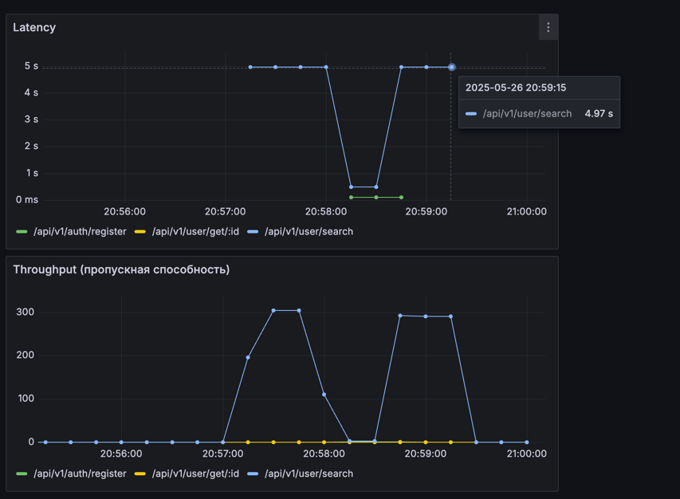
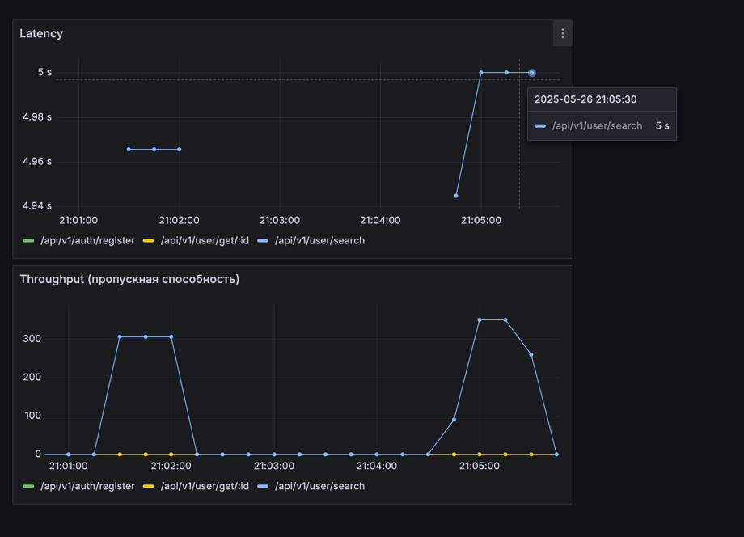

1. Нагружаем базу на 1 млн. пользователей без индексов
2. Нагружаем утилитой hey, один и тот же запрос, в 50 потоков по 100 запросов в течении 10s



3. 50 потоков по 1000 запросов в течении 10s.
Проблем с задержками не обнаружено, латенси не падает.


4. 100 потоков по 10000 запросов в течении 10s.
Видно, что ростет латенси. 



5. Добавим составной GIN индекс на поля first_name, second_name.
Виден значительный прирост производительности.


5. Посмотрим EXPLAIN:
```
EXPLAIN ANALYSE
SELECT
    id,
    first_name,
    last_name,
    email,
    birth_date,
    gender,
    interests,
    city,
    created_at
FROM users
WHERE first_name ILIKE 'First'|| '%'
AND last_name ILIKE 'Last' || '%'
LIMIT 100

Limit  (cost=728.00..732.02 rows=1 width=197) (actual time=0.081..0.087 rows=1 loops=1)
  ->  Bitmap Heap Scan on users  (cost=728.00..732.02 rows=1 width=197) (actual time=0.080..0.081 rows=1 loops=1)
        Recheck Cond: ((first_name ~~* 'First%'::text) AND (last_name ~~* 'Last%'::text))
        Heap Blocks: exact=1
        ->  Bitmap Index Scan on users_name_trgm_idx  (cost=0.00..728.00 rows=1 width=0) (actual time=0.043..0.043 rows=1 loops=1)
              Index Cond: ((first_name ~~* 'First%'::text) AND (last_name ~~* 'Last%'::text))
Planning Time: 0.655 ms
Execution Time: 0.287 ms

```
Это означает, что PostgreSQL сканирует индекс, чтобы найти строки, удовлетворяющие условиям first_name ~~* 'First%' и last_name ~~* 'Last%'.
После того как индекс нашел подходящие строки, PostgreSQL выполняет Bitmap Heap Scan, чтобы получить данные из таблицы users. Битовая карта (bitmap), созданная на этапе Bitmap Index Scan, используется для эффективного доступа к строкам в таблице.

Триграммные индексы в PostgreSQL эффективны для поиска по шаблонам (LIKE, ILIKE, ~~, ~~*), особенно для частичного соответствия строк.


