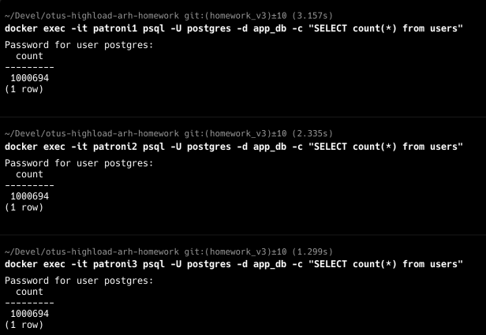

Для выполнения задания поднял:
- кластер pg с patroni для кворумной синхронизации 
- экспортер метрик pg в графану 
- pgpool для распределении нагрузки между репликами

Нагенерил тестовых пользователей и проверил как работает асинхронная репликация на всех 3 реплик 

Настроил jmeter на стратегию нагрузочного тестирования и запустил тест на чтение двух ручек 
и на получения рандомных пользователей и поиск по имени фамилии. 

Далее погасил все реплики - оставил только master  и дал нагрузку на 60 sec:

Далее, включил реплики в асинхронном режиме и дал нагрузку на 60 sec (master-slave-slave):

Видно что нагрузка распределилась по всем репликам на чтение 

Видно, что обработали практически в два раза больше запросов. 

Далее в сценарий добавил запрос на запись и продлил тест на 2 минуты.  
После минуты работы остановил мастер и наблюдал 3 секундный простой на запись и возобновление записи во вторую реплику, после того, 
как patroni переключил его как master.

Вот тут видно, что в patroni1 был мастером и перестал писать 

а потом начал писать вторая реплика patroni2

Видно по графикам, что был простой транзакций и какие-то потери. Сравнил с ситуацией без простоя по количеству запросов 2 мин:

Видно, что простои в скорости обработки точно есть в два раза. Повлияло время переключения. 

