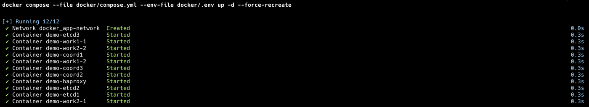
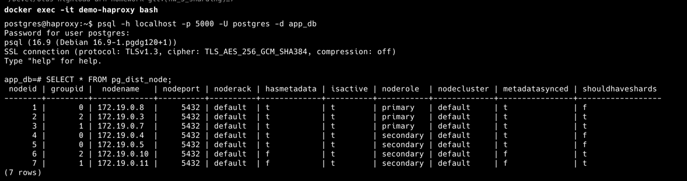
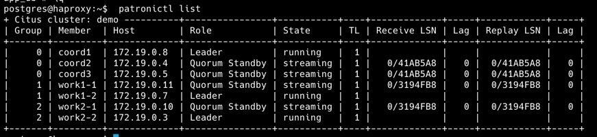

# Задание: Масштабируемая подсистема диалогов

Поднимем распределенный кластер PG с Citus и Patroni на борту






 У нас поднято: 
 - 3 Citus координатора (1 лидер 2 реплики с кворумной репликацией)
 - 4 Citus воркера (2 дидера и 2 ведомых)

Проверим работу:
```sql
app_db=# SELECT citus_version();
                                                            citus_version                                                             
--------------------------------------------------------------------------------------------------------------------------------------
 Citus 13.1devel on aarch64-unknown-linux-gnu, compiled by gcc (Debian 12.2.0-14+deb12u1) 12.2.0, 64-bit gitref: main(sha: 55a0d1f73)
(1 row)
```


Создадим таблицы с распределенными таблицами по шардам:
```sql
app_db=# CREATE TABLE users (
                                id BIGSERIAL PRIMARY KEY,
                                first_name TEXT NOT NULL,
                                last_name TEXT NOT NULL,
                                email TEXT NOT NULL,
                                birth_date DATE NOT NULL,
                                gender TEXT NOT NULL CHECK (gender IN ('male', 'female', 'other')),
                                interests TEXT[],
                                city TEXT NOT NULL,
                                password_hash TEXT NOT NULL,
                                created_at TIMESTAMPTZ NOT NULL DEFAULT NOW(),
                                updated_at TIMESTAMPTZ NOT NULL DEFAULT NOW()
         );
CREATE TABLE
    app_db=# SELECT create_distributed_table('users', 'id');


-- 2. Таблица диалогов
app_db=# CREATE TABLE dialogs (
                                  dialog_id BIGSERIAL,
                                  user1_id BIGINT NOT NULL,
                                  user2_id BIGINT NOT NULL,
                                  created_at TIMESTAMPTZ NOT NULL DEFAULT NOW(),
                                  PRIMARY KEY (dialog_id, user1_id),
                                  CONSTRAINT user_order CHECK (user1_id < user2_id)
         );
-- Колокация с users по user1_id (которая ссылается на users.id)
SELECT create_distributed_table('dialogs', 'user1_id', colocate_with => 'users');

-- 3. Таблица сообщений

-- Создаём новую таблицу с явной привязкой к user_id
CREATE TABLE messages (
                          message_id BIGSERIAL,
                          dialog_id BIGINT NOT NULL,
                          sender_id BIGINT NOT NULL,  -- Будем колоцировать с users.id
                          recipient_id BIGINT NOT NULL,
                          content TEXT NOT NULL,
                          created_at TIMESTAMPTZ NOT NULL DEFAULT NOW(),
                          read_at TIMESTAMPTZ,
                          PRIMARY KEY (message_id, sender_id)
);

-- Распределяем с колокацией на users
SELECT create_distributed_table('messages', 'sender_id', colocate_with => 'users');
-- Проверка распределения
app_db=# SELECT
             t1.table_name as table1,
             t2.table_name as table2,
             t1.colocation_id
         FROM citus_tables t1
                  JOIN citus_tables t2 ON t1.colocation_id = t2.colocation_id AND t1.table_name != t2.table_name;
dialogs  | messages |             7
 dialogs  | users    |             7
 messages | dialogs  |             7
 messages | users    |             7
 users    | dialogs  |             7
 users    | messages |             7
```

Теперь протестим распределение и проверим стратегию защиты от спамеров (эффект Леди Гаги). 
Предлгается выявлять спамеров и решардить их на отдельные шарды.

```go
app_db=# INSERT INTO users (first_name, last_name, email, birth_date, gender, city, password_hash)
VALUES 
    ('User1', 'Testov', 'user1@test.com', '1990-01-01', 'male', 'Moscow', 'hash1'),
    ('User2', 'Testov', 'user2@test.com', '1991-02-02', 'female', 'London', 'hash2'),
    ('User3', 'Testov', 'user3@test.com', '1992-03-03', 'male', 'Paris', 'hash3'),
    ('User4', 'Testov', 'user4@test.com', '1993-04-04', 'female', 'Berlin', 'hash4'),
    ('Spammer', 'Bot', 'spammer@test.com', '1995-05-05', 'other', 'Spamcity', 'hash_spam');
INSERT 0 5
```

Добавляем диалоги между ними 
```sql
    app_db=# INSERT INTO dialogs (user1_id, user2_id)
             VALUES
                 (1, 3), -- User1 ↔ User3
                 (1, 4), -- User1 ↔ User4
                 (1, 5), -- User1 ↔ Spammer
                 (2, 3), -- User2 ↔ User3
                 (3, 4); -- User3 ↔ User4
INSERT 0 5

   

    app_db=# INSERT INTO messages (dialog_id, sender_id, recipient_id, content)
             VALUES
                 (1, 1, 2, 'Привет, User2! Как дела?'),      -- Диалог 1 (User1 ↔ User2)
                 (1, 1, 2, 'Ты получил мое предыдущее сообщение?'),

                 (2, 1, 3, 'User3, привет!'),                -- Диалог 2 (User1 ↔ User3)
                 (2, 1, 3, 'Напомни мне свой номер телефона'),

                 (3, 1, 4, 'User4, мы завтра встречаемся?'), -- Диалог 3 (User1 ↔ User4)

                 (4, 1, 5, 'Спам-сообщение 1'),              -- Диалог 4 (User1 ↔ Spammer)
                 (4, 1, 5, 'Спам-сообщение 2'),
                 (4, 1, 5, 'Спам-сообщение 3'),

                 (5, 2, 3, 'User3, ты видел User1?'),        -- Диалог 5 (User2 ↔ User3)

                 (6, 3, 4, 'User4, передашь документы?');    -- Диалог 6 (User3 ↔ User4)
INSERT 0 10
```

Проверим, что сообщения распределяются на те же шарды, что и пользователи
```sql
app_db=# SELECT
             get_shard_id_for_distribution_column('messages', 5) as message_shard_id,
             get_shard_id_for_distribution_column('dialogs', 5) as dialog_shard_id,
             get_shard_id_for_distribution_column('users', 5) as user_shard_id;
102665 |          102633 |        102601

app_db=# SELECT
             shardid,
             nodename,
             pg_size_pretty(shard_size)
         FROM citus_shards
         WHERE shardid IN (
                           get_shard_id_for_distribution_column('users', 5),
                           get_shard_id_for_distribution_column('dialogs', 5),
                           get_shard_id_for_distribution_column('messages', 5)
             );
102633 | 172.19.0.3  | 8192 bytes
  102633 | 172.19.0.10 | 8192 bytes
  102665 | 172.19.0.3  | 16 kB
  102665 | 172.19.0.10 | 16 kB
  102601 | 172.19.0.3  | 32 kB
  102601 | 172.19.0.10 | 32 kB

-- Какие пользователи на каких шардах
app_db=# SELECT
             u.id,
             u.first_name,
             get_shard_id_for_distribution_column('users', u.id) as user_shard_id,
             (SELECT count(*) FROM dialogs d WHERE d.user1_id = u.id) as dialogs_count,
             (SELECT count(*) FROM messages m WHERE m.sender_id = u.id) as messages_count
         FROM users u
         ORDER BY u.id;
1 | User1      |        102596 |             3 |              8
  2 | User2      |        102619 |             1 |              1
  3 | User3      |        102610 |             1 |              1
  4 | User4      |        102603 |             0 |              0
  5 | Spammer    |        102601 |             0 |              0
  
-- Диалоги поьзвователя
app_db=# SELECT
             m.message_id,
             m.dialog_id,
             m.sender_id,
             m.recipient_id,
             get_shard_id_for_distribution_column('messages', m.sender_id) as shard_id,
             m.content
         FROM messages m
         WHERE m.dialog_id = 1  -- Диалог User1 ↔ User2
         ORDER BY m.created_at;
1 |         1 |         1 |            2 |   102660 | Привет, User2! Как дела?
          2 |         1 |         1 |            2 |   102660 | Ты получил мое предыдущее сообщение?


  
app_db=# SET citus.enable_repartition_joins TO on;
SET

    app_db=# SELECT
    m.message_id,
    m.content,
    m.created_at,
    u2.first_name as recipient_name
    FROM messages m
    JOIN users u1 ON m.sender_id = u1.id
    JOIN dialogs d ON m.dialog_id = d.dialog_id AND m.sender_id = d.user1_id
    JOIN users u2 ON d.user2_id = u2.id
    WHERE u1.email = 'user1@test.com'
    ORDER BY m.created_at DESC;
5 | User4, мы завтра встречаемся?        | 2025-06-22 11:03:25.064276+00 | Spammer
          3 | User3, привет!                       | 2025-06-22 11:03:25.064276+00 | User4
          4 | Напомни мне свой номер телефона      | 2025-06-22 11:03:25.064276+00 | User4
          1 | Привет, User2! Как дела?             | 2025-06-22 11:03:25.064276+00 | User3
          2 | Ты получил мое предыдущее сообщение? | 2025-06-22 11:03:25.064276+00 | User3
  
```

Если мы понимаем, что у нас выделяется спаммер, то изолируем его в отдельный шард:
Добавим тестовых данных для спаммера
```sql

app_db=# INSERT INTO messages (dialog_id, sender_id, recipient_id, content)
         SELECT
             4 as dialog_id,  -- Диалог Spammer (5) ↔ User1 (1)
             5 as sender_id,
             1 as recipient_id,
             'Спам-сообщение ' || generate_series(1, 10)
         FROM generate_series(1, 1000);
INSERT 0 10000
    app_db=# SELECT
                 shardid,
                 nodename,
                 pg_size_pretty(shard_size)
             FROM citus_shards
             WHERE shardid IN (
                               get_shard_id_for_distribution_column('users', 5),
                               get_shard_id_for_distribution_column('dialogs', 5),
                               get_shard_id_for_distribution_column('messages', 5)
                 );
102633 | 172.19.0.3  | 8192 bytes
  102633 | 172.19.0.10 | 8192 bytes
  102665 | 172.19.0.3  | 1496 kB
  102665 | 172.19.0.10 | 1496 kB
  102601 | 172.19.0.3  | 32 kB
  102601 | 172.19.0.10 | 32 kB


```

Попробуем сделать решард для сообщений этого пользователя
```sql

app_db=# SELECT isolate_tenant_to_new_shard('messages', 5, 'CASCADE');
                      102698
                      
                      
app_db=# SELECT
                                   shardid,
                                   nodename,
                                   pg_size_pretty(shard_size)
         FROM citus_shards
         WHERE shardid IN (
                           get_shard_id_for_distribution_column('users', 5),
                           get_shard_id_for_distribution_column('dialogs', 5),
                           get_shard_id_for_distribution_column('messages', 5)
             );
102695 | 172.19.0.3  | 8192 bytes
  102695 | 172.19.0.10 | 8192 bytes
  102698 | 172.19.0.3  | 1496 kB
  102698 | 172.19.0.10 | 1496 kB
  102692 | 172.19.0.3  | 32 kB
  102692 | 172.19.0.10 | 32 kB
```

Видно, что мы перекинули данные на новый шард. 

Теперь давайте попробуем добавить новый шард (воркер) в каластре и распределить.
```sql
app_db=# SELECT * FROM pg_dist_node WHERE isactive = true;
      1 |       0 | 172.19.0.8  |     5432 | default  | t           | t        | primary   | default     | t              | f
      2 |       2 | 172.19.0.3  |     5432 | default  | t           | t        | primary   | default     | t              | t
      3 |       1 | 172.19.0.7  |     5432 | default  | t           | t        | primary   | default     | t              | t
      4 |       0 | 172.19.0.4  |     5432 | default  | t           | t        | secondary | default     | t              | f
      5 |       0 | 172.19.0.5  |     5432 | default  | t           | t        | secondary | default     | t              | f
      6 |       2 | 172.19.0.10 |     5432 | default  | f           | t        | secondary | default     | f              | t
      7 |       1 | 172.19.0.11 |     5432 | default  | f           | t        | secondary | default     | f              | t
      
app_db=# SELECT
                   node.nodename,
                   node.nodeport,
                   COUNT(placement.shardid) AS shard_count
         FROM
                   pg_dist_placement placement
                       JOIN
                   pg_dist_node node ON placement.groupid = node.groupid
                       JOIN
                   pg_dist_shard shard ON placement.shardid = shard.shardid
         WHERE
                   node.isactive = true
         GROUP BY
             node.nodename, node.nodeport
         ORDER BY
                   shard_count DESC;
172.19.0.3  |     5432 |          54
 172.19.0.10 |     5432 |          54
 172.19.0.7  |     5432 |          48
 172.19.0.11 |     5432 |          48


```
Поднимаем две новые ноды  и ребалансируем данные
```sql
postgres@haproxy:~$  patronictl list
+ Citus cluster: demo ----------+----------------+-----------+----+-------------+-----+------------+-----+
    | Group | Member  | Host        | Role           | State     | TL | Receive LSN | Lag | Replay LSN | Lag |
+-------+---------+-------------+----------------+-----------+----+-------------+-----+------------+-----+
|     0 | coord1  | 172.19.0.8  | Leader         | running   |  1 |             |     |            |     |
|     0 | coord2  | 172.19.0.4  | Quorum Standby | streaming |  1 |   0/48E8F40 |   0 |  0/48E8F40 |   0 |
|     0 | coord3  | 172.19.0.5  | Quorum Standby | streaming |  1 |   0/48E8F40 |   0 |  0/48E8F40 |   0 |
|     1 | work1-1 | 172.19.0.11 | Quorum Standby | streaming |  1 |   0/495DEE8 |   0 |  0/495DEE8 |   0 |
|     1 | work1-2 | 172.19.0.7  | Leader         | running   |  1 |             |     |            |     |
|     2 | work2-1 | 172.19.0.10 | Quorum Standby | streaming |  1 |   0/4EF8A90 |   0 |  0/4EF8A90 |   0 |
|     2 | work2-2 | 172.19.0.3  | Leader         | running   |  1 |             |     |            |     |
|     3 | work3-1 | 172.19.0.13 | Leader         | running   |  1 |             |     |            |     |
|     3 | work3-2 | 172.19.0.14 | Replica        | running   |  1 |   0/3000000 |   0 |  0/3000000 |   0 |
+-------+---------+-------------+----------------+-----------+----+-------------+-----+------------+-----+
postgres@haproxy:~$ psql -h localhost -p 5000 -U postgres -d app_db
Password for user postgres: 
psql (16.9 (Debian 16.9-1.pgdg120+1))
SSL connection (protocol: TLSv1.3, cipher: TLS_AES_256_GCM_SHA384, compression: off)
Type "help" for help.

app_db=# SELECT citus_add_node('172.19.0.13', 5432, groupid => 3, noderole => 'primary');
citus_add_node 
----------------
              8
(1 row)

app_db=# SELECT citus_add_node('172.19.0.14', 5432, groupid => 3, noderole => 'secondary');
citus_add_node 
----------------
              9
(1 row)

app_db=# SELECT * FROM pg_dist_node WHERE groupid = 3;
nodeid | groupid |  nodename   | nodeport | noderack | hasmetadata | isactive | noderole  | nodecluster | metadatasynced | shouldhaveshards 
--------+---------+-------------+----------+----------+-------------+----------+-----------+-------------+----------------+------------------
      8 |       3 | 172.19.0.13 |     5432 | default  | t           | t        | primary   | default     | t              | t
      9 |       3 | 172.19.0.14 |     5432 | default  | f           | t        | secondary | default     | f              | t
(2 rows)

app_db=# SELECT rebalance_table_shards();
NOTICE:  Moving shard 102692 from 172.19.0.3:5432 to 172.19.0.13:5432 ...
NOTICE:  Moving shard 102619 from 172.19.0.3:5432 to 172.19.0.13:5432 ...
NOTICE:  Moving shard 102596 from 172.19.0.7:5432 to 172.19.0.13:5432 ...
NOTICE:  Moving shard 102603 from 172.19.0.3:5432 to 172.19.0.13:5432 ...
NOTICE:  Moving shard 102610 from 172.19.0.7:5432 to 172.19.0.13:5432 ...
NOTICE:  Moving shard 102595 from 172.19.0.3:5432 to 172.19.0.13:5432 ...
NOTICE:  Moving shard 102598 from 172.19.0.7:5432 to 172.19.0.13:5432 ...
NOTICE:  Moving shard 102597 from 172.19.0.3:5432 to 172.19.0.13:5432 ...
NOTICE:  Moving shard 102600 from 172.19.0.7:5432 to 172.19.0.13:5432 ...
NOTICE:  Moving shard 102599 from 172.19.0.3:5432 to 172.19.0.13:5432 ...
NOTICE:  Moving shard 102602 from 172.19.0.7:5432 to 172.19.0.13:5432 ...
 rebalance_table_shards 
------------------------
 


app_db=# SELECT * FROM pg_dist_node WHERE isactive = true;
nodeid | groupid |  nodename   | nodeport | noderack | hasmetadata | isactive | noderole  | nodecluster | metadatasynced | shouldhaveshards 
--------+---------+-------------+----------+----------+-------------+----------+-----------+-------------+----------------+------------------
      1 |       0 | 172.19.0.8  |     5432 | default  | t           | t        | primary   | default     | t              | f
      2 |       2 | 172.19.0.3  |     5432 | default  | t           | t        | primary   | default     | t              | t
      3 |       1 | 172.19.0.7  |     5432 | default  | t           | t        | primary   | default     | t              | t
      4 |       0 | 172.19.0.4  |     5432 | default  | t           | t        | secondary | default     | t              | f
      5 |       0 | 172.19.0.5  |     5432 | default  | t           | t        | secondary | default     | t              | f
      6 |       2 | 172.19.0.10 |     5432 | default  | f           | t        | secondary | default     | f              | t
      7 |       1 | 172.19.0.11 |     5432 | default  | f           | t        | secondary | default     | f              | t
      8 |       3 | 172.19.0.13 |     5432 | default  | t           | t        | primary   | default     | t              | t
      9 |       3 | 172.19.0.14 |     5432 | default  | f           | t        | secondary | default     | f              | t
(9 rows)

app_db=# SELECT
             node.nodename,
             node.nodeport,
             COUNT(placement.shardid) AS shard_count
         FROM
             pg_dist_placement placement
                 JOIN
             pg_dist_node node ON placement.groupid = node.groupid
                 JOIN
             pg_dist_shard shard ON placement.shardid = shard.shardid
         WHERE
             node.isactive = true
         GROUP BY
             node.nodename, node.nodeport
         ORDER BY
             shard_count DESC;
nodename   | nodeport | shard_count 
-------------+----------+-------------
 172.19.0.3  |     5432 |          36
 172.19.0.10 |     5432 |          36
 172.19.0.7  |     5432 |          33
 172.19.0.11 |     5432 |          33
 172.19.0.14 |     5432 |          33
 172.19.0.13 |     5432 |          33
(6 rows)


```

Принудительно переключим лидера у второй группы: 
```sql
postgres@haproxy:~$ patronictl switchover --group 2 --force
Current cluster topology
+ Citus cluster: demo (group: 2, 7518696338913472535) ----+-------------+-----+------------+-----+
| Member  | Host        | Role           | State     | TL | Receive LSN | Lag | Replay LSN | Lag |
+---------+-------------+----------------+-----------+----+-------------+-----+------------+-----+
| work2-1 | 172.19.0.10 | Quorum Standby | streaming |  1 |   0/5017618 |   0 |  0/5017618 |   0 |
| work2-2 | 172.19.0.3  | Leader         | running   |  1 |             |     |            |     |
+---------+-------------+----------------+-----------+----+-------------+-----+------------+-----+
2025-06-22 12:23:56.46382 Successfully switched over to "work2-1"
+ Citus cluster: demo (group: 2, 7518696338913472535) ---------+-----+------------+-----+
| Member  | Host        | Role    | State   | TL | Receive LSN | Lag | Replay LSN | Lag |
+---------+-------------+---------+---------+----+-------------+-----+------------+-----+
| work2-1 | 172.19.0.10 | Leader  | running |  1 |             |     |            |     |
| work2-2 | 172.19.0.3  | Replica | stopped |    |     unknown |     |    unknown |     |
+---------+-------------+---------+---------+----+-------------+-----+------------+-----+
```

Решение хорошее, но так и не удалось настроить SSL-сертификаты для клиента. 
Перешел к кластеру на одном Citus:
---
```sql
SELECT * FROM pg_available_extensions WHERE name = 'citus';
 name  | default_version | installed_version |          comment           
-------+-----------------+-------------------+----------------------------
 citus | 13.0-1          |                   | Citus distributed database
```


Проверил тестовое распределение 
```sql
app_db=# SELECT
             get_shard_id_for_distribution_column('messages', 5) as message_shard_id,
             get_shard_id_for_distribution_column('dialogs', 5) as dialog_shard_id,
             get_shard_id_for_distribution_column('users', 5) as user_shard_id;
 message_shard_id | dialog_shard_id | user_shard_id 
------------------+-----------------+---------------
           102078 |          102046 |        102014
(1 row)

app_db=# SELECT
             shardid,
             nodename,
             pg_size_pretty(shard_size)
         FROM citus_shards
         WHERE shardid IN (
                           get_shard_id_for_distribution_column('users', 5),
                           get_shard_id_for_distribution_column('dialogs', 5),
                           get_shard_id_for_distribution_column('messages', 5)
             );
 shardid | nodename  | pg_size_pretty 
---------+-----------+----------------
  102046 | localhost | 8192 bytes
  102078 | localhost | 16 kB
  102014 | localhost | 32 kB
```


Все ок. Теперь реализуем ручки и обработчики для диалогов


