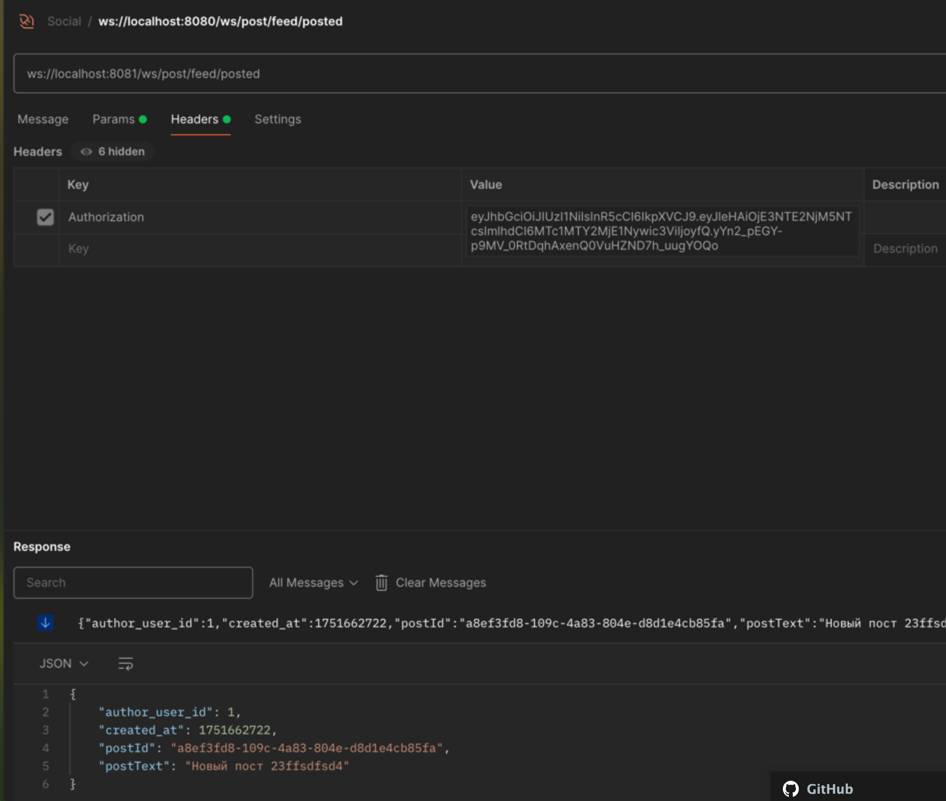

- добавлены контейнеры kafka
- на создание, обновление постов уходит сообщение в топик
- поднят отдельный асинхронный фидер, который слушает топик и рассылает всем друзьям пользователя ws-сообщения

