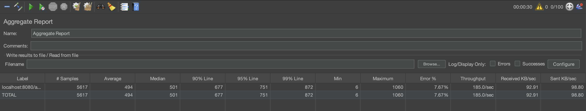
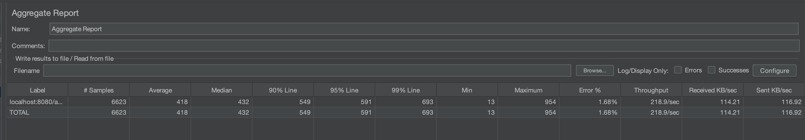
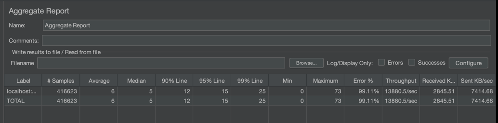

Решил добавить imMemory только на список зарегистрированных ранее телефонов.

Хранение ранее зарегистрированных телефонов будет храниться в redis, проверка, был ли ранее уже такой польователь будет
только через KV-хранилище.

Сначала снимем текущую пропускную способность ручки /v1/register OLTP PG:

Далее прикрутили KV и сделали повторные замеры

Видно, что througout подрос на процентов 30%

Следующий шаг:
- выносим логику регистрации и хранения email в redis UDF. Реалиция небольшого скрипта на lua
- сохранение в основную базу делаем асинхронной операцией 
- запускаем еще один тест 

Видим прирост производительности более чем в 50 раз